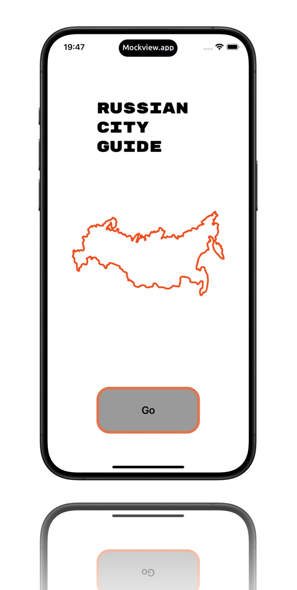
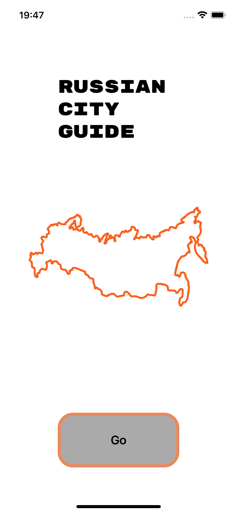
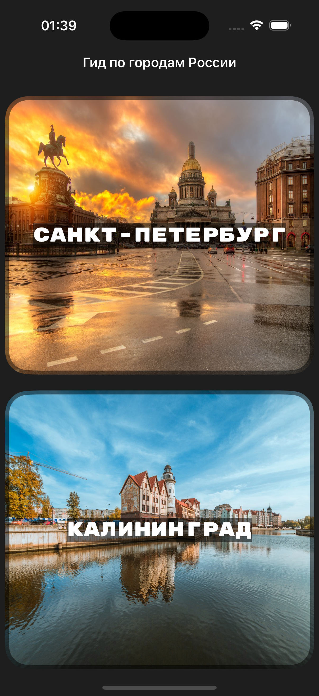

<ins><b><h1 align="center" face="sans-serif">RUSSIAN CITY GUIDE🇷🇺</h1></b></ins>

This is my pet-project. Here i did a guide for russian cities, where You can check photos, read a short descriprtion, see the map and know about weather in city. 

I used UIKit, Realm, KingFisher and some APIs, like Unsplash and WeatherAPI.
<h2 align="center">Start screen of app:</h2>

<h2 align="center">Main screen of app:
Here You can choose what city to explore</h2>

